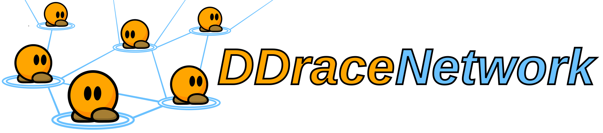
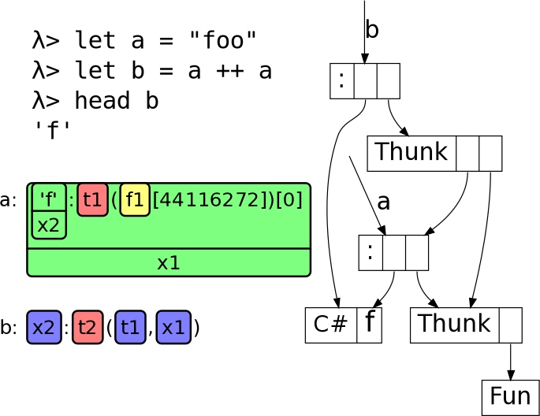
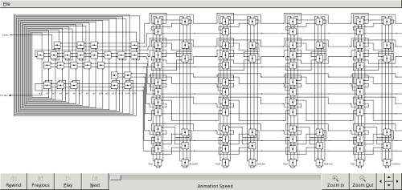
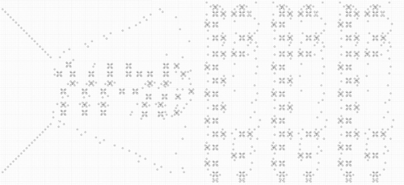
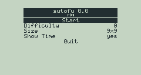
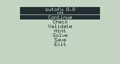
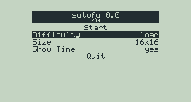
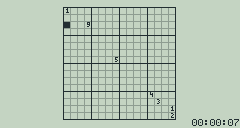

# Software

## HookRace (since 2014)

Planned successor of [DDNet](https://ddnet.tw/), but then turned into my blog:

- [HookRace Blog](https://hookrace.net/)

## The Nim programming language (since 2014)

I'm pretty interested in [Nim](http://nim-lang.org/), a great new programming language, and am an active contributor:

- [nim-unsorted](https://github.com/def-/nim-unsorted): A huge list of small programs I wrote in Nim
- [My libraries](https://github.com/search?q=user%3Adef-+nim)

I held a talk at the [GPN14](https://entropia.de/GPN14) about Nim:

- [Slides](../nimrod/nimrod-gpn14.pdf) (in German)
- [Talk Website](https://entropia.de/GPN14:Nimrod) (in German)
- [Video Recording](http://media.ccc.de/browse/conferences/gpn/gpn14/gpn14_-_5892_-_de_-_zkm-vortragssaal_-_201406211130_-_nimrod_-_dennis_felsing.html#video) (in German)

## Fuzzing Open Source Software (2014)

Using [AFL](http://lcamtuf.coredump.cx/afl/) I have discovered a few interesting crashes in software:

- [WavPack](https://github.com/dbry/WavPack/commit/5d4e146c9f40b08c6a2a6c35dd8340f7fb1d837c)
- [opus-tools](https://git.xiph.org/?p=opus-tools.git;a=commit;h=f6963f289a4644bc11ab68934b9ce2df870a8516)
- [zsh](http://www.zsh.org/mla/workers/2014/msg01668.html)
- FreeType: [CFF](http://git.savannah.gnu.org/cgit/freetype/freetype2.git/commit/?id=c9ca6ffc9442b4b127f948e2d993454aa7791e59), [T42](http://git.savannah.gnu.org/cgit/freetype/freetype2.git/commit/?id=b94381134efd41c6885d38e08d14106feec7284b)
- [MKVToolNix](https://trac.bunkus.org/ticket/1089)

## DDraceNetwork (since 2013)

DDraceNetwork is a special version of DDRace, a Teeworlds modification. Help each other finish races with up to 64 players, compete against the best in international tournaments, design your own maps, or run your own server. The official servers are located in Germany, USA, Canada, Russia, China, Chile, Brazil and South Africa. All ranks made on official servers are available everywhere and you can collect points!

- [Website](https://ddnet.tw/)
- [Game repository](https://github.com/def-/ddnet)
- [Maps repository](https://github.com/def-/ddnet-maps)

## Haskell
### gifstream (2012)

Make interactive games in Haskell using GIF streams that can be shown in the webbrowser. An example of snake is included. Compile and run:

    $ ghc -O3 -threaded SnakeFinished.hs
    $ ./SnakeFinished
    Listening on http://127.0.0.1:5002/

Control using WASD in the terminal, output in the browser looks like this:

- [on GitHub](https://github.com/def-/gifstream)

### ghc-datasize (2012)

ghc-datasize is a tool to determine the size of Haskell data structures in GHC's memory. Determining the size of recursive data structures is supported. All sizes are in Bytes.

- [Website](../ghc-datasize)
- [on Hackage](http://hackage.haskell.org/package/ghc-datasize)
- [on GitHub](https://github.com/def-/ghc-datasize)

### ghc-vis (2012)

Visualize live data structures in GHCi. Evaluation is not forced and you can interact with the visualized data structures. This allows seeing Haskell's lazy evaluation and sharing in action.

- [Website](../ghc-vis)
- [on Hackage](http://hackage.haskell.org/package/ghc-vis)
- [on GitHub](https://github.com/def-/ghc-vis)

### xdot (2012)

Parse Graphviz xdot files and interactively view them in a GTK window.

Currently not all xdot features are supported. Nodes and edges can be highlighted by hovering them and clicked.

For an example of using this library try the accompanying Demo.hs with the dot-files in dot-examples/.

- [on Hackage](http://hackage.haskell.org/package/xdot)
- [on GitHub](https://github.com/def-/xdot)

## Rotary Element Simulation (2012)

 
 

Simulates Rotary Element circuits. Contains the examples from the [original paper](http://www.springerlink.com/content/2gq878u4w7jwyu2u/).

- [Source Code](https://github.com/def-/re-simulation)

Simulation files for the P3 cellular automaton and some Rotary Elements in it:

- [Golly files](../rotary-element/ca-simulation.tar.bz2)

## tach (2009)

tach is a script that provides automatic detaching and reattaching of terminals using [dtach](http://dtach.sf.net/).

- [Source Code](https://github.com/def-/tach)

## reverse rsync backup (2009)

rrb is a simple set of scripts to take backups by hand and automatically by a backup server using [rsync](https://rsync.samba.org/) and manage them.

- [Source Code](https://github.com/def-/rrb)
- [Elaboration](../rrb/ausarbeitung.pdf) (in German), [source](../rrb/ausarbeitung.tar.bz2)

## Sutofu (2009)

Sudoku game and solver for TI V200.

 

- [Source Code](../sutofu/sutofu.tar.bz2)

## simple xmpp client (2008) (unmaintained)

sxc is for jabber what [ii (irc it)](http://tools.suckless.org/ii/) is for IRC: A minimalistic file-oriented jabber client which runs in the background and can be controlled by using basic command line tools to read from/write into the files/FIFOs sxc creates.

- [libsxc](https://github.com/def-/libsxc)
- [sxc](https://github.com/def-/sxc)
- [sxc-tools](https://github.com/def-/sxc-tools)
- [sxc-scripts](https://github.com/def-/sxc-scripts)
- [Presentation](../sxc/beamer.pdf) (in German), [source](../sxc/beamer.tar.bz2)

## ajaxWM (2008) (unmaintained)

ajaxWM is a window manager in a web browser, a terminal emulator and an SSH proxy. It allows remote controlling a computer even when there is a firewall and packet analyzer between, blocking everything else than HTTP(S)-connections. Because the ajaxWM client runs in any javascript-capable web browser, you can even use it when you are not allowed to install any software, for example in an internet café, at school, or at work.

- [on SourceForge](http://ajaxwm.sf.net/)
- [Elaboration](../ajaxwm/ausarbeitung.pdf) (in German), [source](../ajaxwm/ausarbeitung.tar.bz2)
- [Presentation](../ajaxwm/beamer.pdf) (in German), [source](../ajaxwm/beamer.tar.bz2)
- [Handout](../ajaxwm/handout.pdf) (in German), [source](../ajaxwm/handout.tar.bz2)
